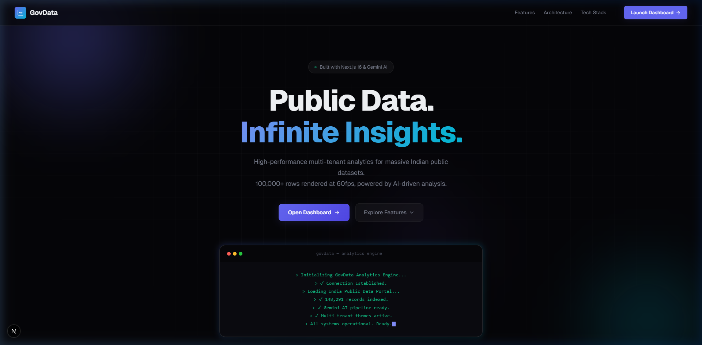
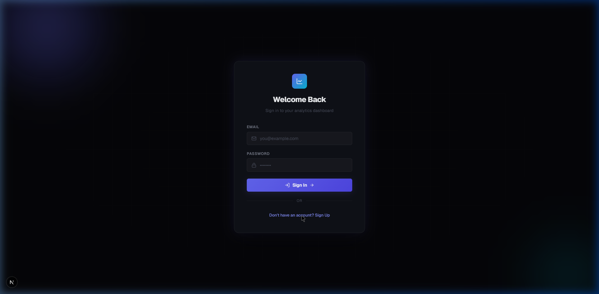
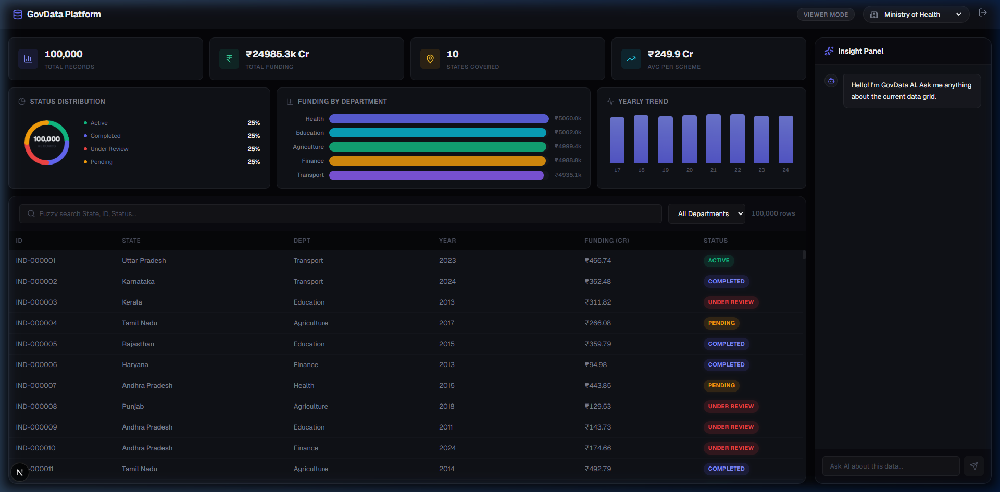
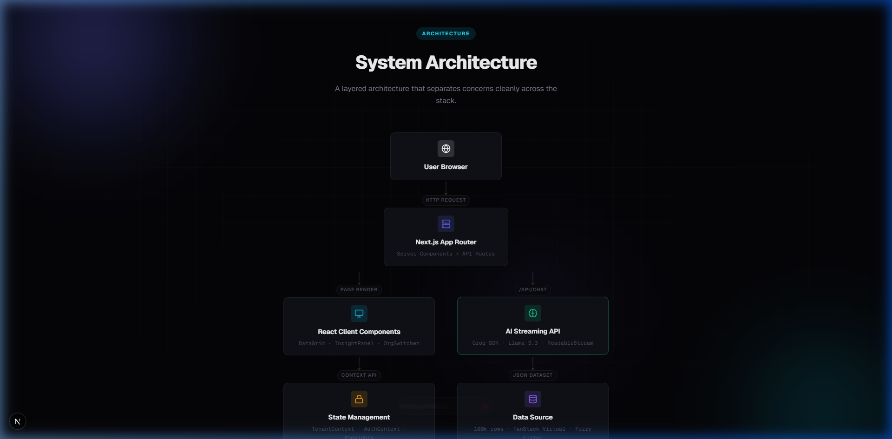

# 🏛️ GovData Analytics Platform

> High-performance multi-tenant analytics dashboard for Indian public data — built with Next.js 16, Supabase, and Google Gemini AI.



---

## 🚀 Live Demo & Links

| Resource | Link |
|:---|:---|
| **Live Site** | *[Your Vercel/Netlify URL]* |
| **GitHub** | *[Your GitHub Repo URL]* |

---

## 📸 Screenshots

<table>
  <tr>
    <td><br/><strong>Landing Page</strong></td>
    <td><br/><strong>Supabase Auth</strong></td>
  </tr>
  <tr>
    <td><br/><strong>Analytics Dashboard</strong></td>
    <td><br/><strong>Architecture Diagram</strong></td>
  </tr>
</table>

---

## 🏗️ Architecture

```
┌────────────────────────────────────────────────────────────────┐
│                    GovData Analytics Platform                   │
├──────────────┬──────────────┬──────────────┬──────────────────-─┤
│  Frontend    │   Data       │   AI Layer   │   Platform         │
│              │              │              │                    │
│  Next.js 16  │  100k+ rows  │  Gemini 2.0  │  Supabase Auth     │
│  App Router  │  Virtualized │  Flash       │  Multi-tenant      │
│  CSS Modules │  JSON dataset│  Streaming   │  RBAC (Admin/View) │
│  Lucide Icons│  Fuzzy Search│  Context-    │  Org Switcher      │
│              │              │  Aware       │  Dynamic Themes    │
└──────────────┴──────────────┴──────────────┴────────────────────┘
```

### Data Flow
```
User → Landing Page (/) → Auth (/login) → Dashboard (/dashboard)
                                               │
                         ┌─────────────────────┼─────────────────────┐
                         │                     │                     │
                    Org Switcher         Data Pipeline           AI Panel
                    (TenantContext)           │                     │
                         │           ┌───────┴────────┐      Gemini API
                    Filters data     │                │      (streaming)
                    by department    Charts        DataGrid
                                   (KPI, Donut,   (100k rows,
                                    Bar, Trend)    virtualized)
```

---

## 📊 Data Handling Approach

### Dataset
- **Source**: Indian government scheme dataset (inspired by [data.gov.in](https://data.gov.in))
- **Size**: **100,000+ rows** with 7 columns: ID, State, Department, Year, Funding (Crores), Status, Beneficiaries
- **Generation**: `scripts/generateData.js` procedurally generates realistic data across 10 Indian states, 5 departments, 8 years (2017–2024), and 4 statuses
- **Format**: Static JSON served from `/public/data/dataset.json` (~14MB)

### Why Static JSON?
- Zero database latency — data loads in a single HTTP request
- Client-side filtering is instant with no network roundtrips
- Demonstrates raw frontend performance handling massive datasets
- The focus is on virtualization and rendering, not backend optimization

---

## ⚡ Virtualization Strategy

Rendering 100,000+ DOM rows would destroy performance. Our approach:

| Technique | Implementation |
|:---|:---|
| **Virtual Scrolling** | `@tanstack/react-virtual` renders only ~30 visible rows at any time |
| **Fixed Row Height** | 40px per row for O(1) offset calculations |
| **Overscan** | 15 rows above/below viewport for smooth scrolling |
| **Memoization** | `useMemo` on filtered data prevents re-computation |
| **No Re-renders** | Absolute positioning with `transform: translateY()` — zero layout shifts |

**Result**: 60fps scrolling through 100,000 rows with <50ms filter response.

---

## 🔍 Fuzzy Search

Custom scoring algorithm (no external library) that handles:

- **Typo tolerance**: `"Maharshtra"` → finds **Maharashtra**
- **Partial matches**: `"keral"` → finds **Kerala**
- **Multi-field**: Searches across ID, State, Department, Year, and Status simultaneously
- **Ranked results**: Scoring bonuses for consecutive matches, start-of-word hits, and exact case

```
Score = Base + ConsecutiveBonus + WordStartBonus + CaseBonus - SpreadPenalty
```

---

## 🏢 Multi-Tenancy Logic

### How Org Switching Works

```
TenantContext (React Context)
    │
    ├── tenant = "health" | "agriculture" | "finance"
    │
    └── Dashboard page.js
         │
         ├── Maps tenant → department name
         │   { health: "Health", agriculture: "Agriculture", finance: "Finance" }
         │
         ├── Filters 100k dataset to ~20k rows for active tenant
         │
         ├── Passes filtered data → DashboardCharts
         │   (KPIs, donut, bar, trend recalculate)
         │
         └── Passes filtered data → DataGrid
             (only shows rows for that department)
```

### What Changes Per Tenant
| Element | Changes? |
|:---|:---|
| CSS Theme (colors) | ✅ Indigo / Green / Amber |
| KPI Card values | ✅ Recalculated per department |
| Charts (donut, bar, trend) | ✅ Filtered to department data |
| Data Grid rows | ✅ Only shows department's rows |
| AI context | ✅ AI knows active department |

### RBAC Access Control
| Role | Capabilities |
|:---|:---|
| **Admin** | Full grid + Edit/Delete column visible |
| **Viewer** | Read-only grid, no action column |

Toggle via the pill button in the navbar. Role is stored in React Context and consumed by DataGrid.

---

## 🤖 AI Prompt Design (Gemini)

### Architecture
```
InsightPanel (client) → POST /api/chat → Google Gemini 2.0 Flash → Stream back
```

### System Prompt Strategy
The AI receives **live context** from the current grid filters:

```javascript
systemInstruction: `You are the AI assistant for the GovData Analytics Platform.
Current Grid Filters:
- Department: ${context.department}
- Search Query: ${context.query || 'none'}  
- Rows Visible: ${context.count}
The dataset contains Indian government scheme data with columns:
ID, State, Department, Year, Funding (Crores), Status, Beneficiaries.
Use this context to shape your answers. Be professional, analytical, concise.`
```

### Key Design Decisions
1. **Context-aware**: The AI knows which filters are active, so it gives relevant answers
2. **Streaming**: `generateContentStream()` sends tokens as they arrive — no waiting for full response
3. **Thinking state**: A "Thinking..." pill appears before the response streams in
4. **Error handling**: Graceful fallback messages for rate limits and API failures

---

## 🔐 Authentication (Supabase)

| Feature | Detail |
|:---|:---|
| **Provider** | Supabase (BaaS) |
| **Method** | Email + Password |
| **Client** | `@supabase/ssr` (Next.js App Router compatible) |
| **Auth Guard** | Dashboard layout checks session → redirects to `/login` if unauthenticated |
| **Session** | `onAuthStateChange` listener keeps user state in sync |
| **Sign Out** | Clears Supabase session and redirects to `/login` |

### Flow
```
Landing Page → "Launch Dashboard" → /login (if not authenticated)
    → Sign Up / Sign In → Supabase validates → Redirect to /dashboard
    → Sign Out button → Clears session → /login
```

---

## 🎨 Design Standards

### Visual Language
- **Theme**: Minimalist Dark Mode with clean gradients
- **Typography**: Geist Sans + Geist Mono (modern sans-serif)
- **Colors**: Custom CSS properties with HSL-based palette
- **Animations**: Scroll-reveal, shimmer loaders, pulse-glow, ambient orbs
- **Charts**: Pure CSS/SVG — no external charting library

### UI Components
| Component | Styling Approach |
|:---|:---|
| Landing Hero | Gradient text, animated terminal, ambient orbs |
| Bento Grid | Feature cards with hover effects |
| Data Grid | Virtualized rows, colored status badges |
| KPI Cards | Gradient icons, large typography |
| Charts | SVG donut, CSS bar charts, gradient trend bars |
| Login | Glassmorphic card with glow effects |
| Command Palette | `Cmd+K` modal with search |

### Responsive Design
- Landing page: Mobile-friendly with responsive grids
- Dashboard: Adapts from desktop (side panel) to tablet (stacked layout)
- Login: Centered card that works on all screen sizes

---

## 🛠️ Tech Stack

| Layer | Technology |
|:---|:---|
| **Framework** | Next.js 16 (App Router, React 19) |
| **Styling** | CSS Modules + CSS Custom Properties |
| **Virtualization** | @tanstack/react-virtual |
| **AI** | @google/generative-ai (Gemini 2.0 Flash) |
| **Auth** | Supabase (@supabase/ssr) |
| **Icons** | Lucide React |
| **Fonts** | Geist Sans & Geist Mono |
| **State** | React Context (AuthContext, TenantContext) |

---

## 📁 Project Structure

```
src/
├── app/
│   ├── page.js                  # Landing page
│   ├── page.module.css          # Landing styles
│   ├── globals.css              # Design system & tokens
│   ├── layout.js                # Root layout + providers
│   ├── login/
│   │   ├── page.js              # Auth page (sign in/up)
│   │   └── login.module.css
│   ├── dashboard/
│   │   ├── layout.js            # Navbar + auth guard
│   │   ├── page.js              # Dashboard page (data fetching)
│   │   ├── page.module.css
│   │   └── dashboard.module.css
│   └── api/
│       └── chat/
│           └── route.js         # Gemini AI streaming endpoint
├── components/
│   ├── dashboard/
│   │   ├── DataGrid.js          # 100k row virtualized grid
│   │   ├── DashboardCharts.js   # KPI cards + charts
│   │   ├── InsightPanel.js      # AI chat panel
│   │   └── OrgSwitcher.js       # Multi-tenant switcher
│   └── common/
│       └── CommandPalette.js    # Cmd+K search
├── contexts/
│   ├── AuthContext.js           # Supabase auth + RBAC
│   ├── TenantContext.js         # Multi-tenant state
│   └── Providers.js             # Context wrapper
├── lib/
│   └── supabase.js              # Supabase client
└── scripts/
    └── generateData.js          # Dataset generator
```

---

## 🏃 Getting Started

```bash
# 1. Clone
git clone <your-repo-url>
cd govdata-platform

# 2. Install
npm install

# 3. Environment Variables
cp .env.local.example .env.local
# Add your keys:
# GEMINI_API_KEY=your-gemini-key
# NEXT_PUBLIC_SUPABASE_URL=your-supabase-url
# NEXT_PUBLIC_SUPABASE_ANON_KEY=your-supabase-anon-key

# 4. Generate Dataset (if not present)
node scripts/generateData.js

# 5. Run
npm run dev
```

Open [http://localhost:3000](http://localhost:3000)

---

## 📝 Assignment Checklist

| # | Requirement | Status |
|:---|:---|:---|
| 1 | Dark Mode landing page | ✅ |
| 2 | Scroll-reveal animations | ✅ |
| 3 | Bento Grid features section | ✅ |
| 4 | Interactive hero element (terminal) | ✅ |
| 5 | 100k+ virtualized data grid | ✅ |
| 6 | Multi-column filtering | ✅ |
| 7 | Fuzzy search | ✅ |
| 8 | Sticky headers | ✅ |
| 9 | Org Switcher (multi-tenant) | ✅ |
| 10 | Dynamic theme + data per department | ✅ |
| 11 | Admin/Viewer RBAC | ✅ |
| 12 | Gemini AI Insight Panel | ✅ |
| 13 | Token-by-token streaming | ✅ |
| 14 | "Thinking..." indicator | ✅ |
| 15 | Context-aware AI responses | ✅ |
| 16 | Cmd+K Command Palette | ✅ |
| 17 | Skeleton loading states | ✅ |
| 18 | Modern typography (Geist) | ✅ |
| 19 | Supabase Authentication | ✅ |
| 20 | Responsive design | ✅ |

---

Built with ❤️ for the Frontend Engineering Assignment
