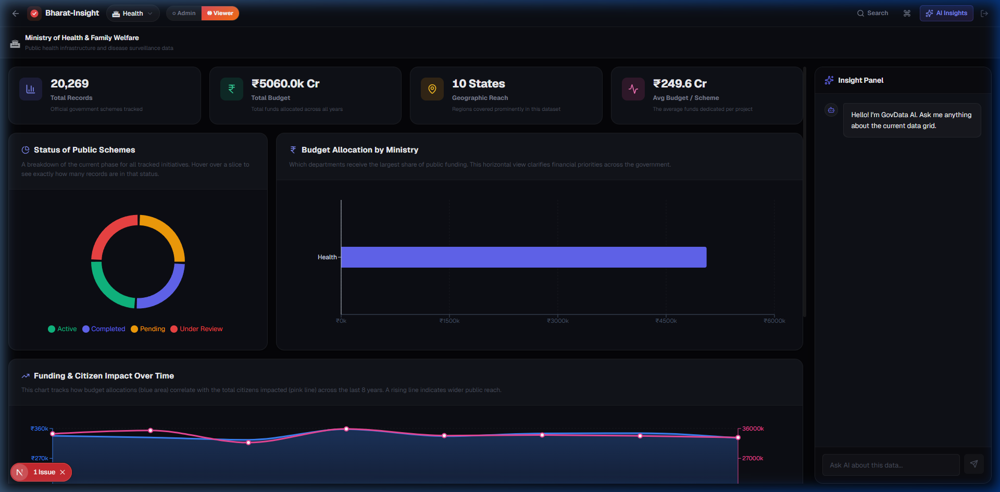
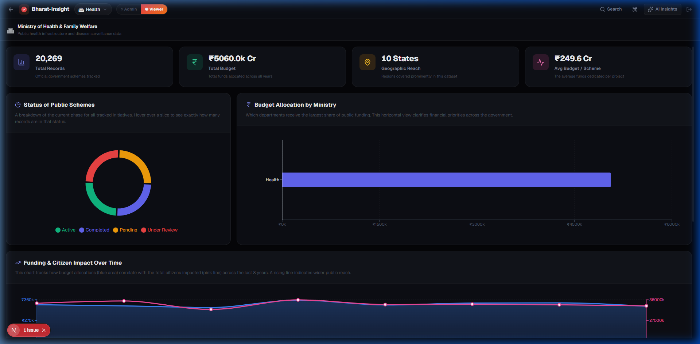

<div align="center">
  

  <h1>🇮🇳 Bharat-Insight Analytics Platform</h1>
  <p><strong>A high-performance, multi-tenant public data analytics platform built to make exploring massive Indian government datasets (data.gov.in) fast, elegant, and intelligent.</strong></p>
  
  <h3>🚀 <a href="https://bharat-insight-sepia.vercel.app">Live Demo on Vercel</a></h3>
</div>

---

## 📸 Platform Previews

### 1. The Interactive Data Grid & AI Panel
*Explore 100,000+ rows of public government data with an integrated AI assistant that reads your currently filtered data.*


### 2. Expanded Workspace (AI Panel Collapsed)
*Need more room for data? Toggle the AI Insights button in the navigation bar to smoothly expand the data grid to full width.*


---

## 🌟 Comprehensive Feature Set

### ⚡ Ultra-Fast Data Operations
*   **Virtual Scrolling:** Renders a 14MB+ JSON file containing over 100,000 rows instantly using `TanStack Virtual`. The browser only draws what you see on the screen, completely eliminating lag and paginated loading wait times.
*   **Instant Fuzzy Search:** Filter through massive datasets in milliseconds. 

### ✨ Context-Aware AI Sidekick
*   **Intelligent Prompt Injection:** By capturing your active grid filters (e.g., "Show me active health schemes in Gujarat"), the Next.js API route injects that exact context into the LLM system prompt. 
*   **Streaming Responses:** Powered by OpenAI, the `InsightPanel` streams responses chunk-by-chunk using raw HTTP Streams, providing immediate feedback without waiting for long generation times.
*   **Markdown Parsing:** Custom-styled markdown parsing ensures the AI's data summaries are beautiful, structured, and easy to read.

### 🏛 Multi-Ministry Architecture
*   **Tenant Switching:** Uses a global Zustand store (`tenantStore`) to let users easily flip between data from the **Ministry of Health**, **Ministry of Agriculture**, and **Ministry of Finance**.
*   **Dynamic Visuals:** The UI, sub-headers, and charts completely redraw and adapt their context based on the current active ministry.

### 🔒 Secure Role-Based Access Control (RBAC)
*   **Strict Security:** The `admin` role is rigidly assigned via context to specific authorized emails only, preventing unauthorized access. 
*   **Admin Utilities:** Authorized admins experience exclusive UI capabilities, such as destructive DataGrid actions (Delete) natively built into the TanStack Virtualized rows.
*   **Supabase Authentication:** Secure, industry-standard authentication flow handling session management natively through lightweight UI elements.

### 📊 KPI Dashboards & Regional Heatmaps
*   **Dynamic Visualizations:** Integrated Recharts to render real-time Funding Trends and Regional Allocation Breakdowns (Top 5 States).
*   **Algorithmic Summaries:** Instant computation of Efficiency Metrics and Beneficiaries Impacted based purely on active user filter combinations.

### ⌨️ Command Palette (Cmd+K)
*   **Power User Navigation:** Hit `Cmd + K` or `Ctrl + K` to bring up a Spotlight-style search bar. 
*   Quickly jump between pages, swap ministries, toggle your admin role, or invoke the AI panel—all without using the mouse.

---

## 🏗️ Technical Architecture & Stack

### Core Technologies
*   **Framework:** **Next.js 16** (App Router) - Leveraging Server Components for optimal performance and secure API routes for AI key protection.
*   **Library:** **React 19**
*   **Language:** JavaScript (ES6+)

### State Management & Data
*   **State:** **Zustand** - Used for lightweight, boilerplate-free global state (Auth, UI visibility, Tenant selection).
*   **Virtualization:** **TanStack Virtual v3** - Essential for maintaining 60FPS while scrolling massive DOM lists.

### UI & Styling
*   **CSS:** **Vanilla CSS Modules** (`.module.css`) - Highly modular, locally scoped styling combined with powerful global variables (`var(--primary-color)`).
*   **Icons:** **Lucide React** - Clean, consistent iconography.
*   **Typography:** **Geist Sans & Geist Mono** via `next/font`.

---

## 🚀 Local Development Setup

Want to run Bharat-Insight on your own machine? Follow these easy steps:

### 1. Clone the repository
```bash
git clone https://github.com/namyaJ/bharat-insigh.git
cd bharat-insigh
```

### 2. Install dependencies
```bash
npm install
```

### 3. Setup Environment Variables
To make the AI magic happen, you need API keys. Create a `.env.local` file in the root folder and add the following:
```env
# AI Service API Key (Server-side only)
AI_SERVICE_KEY=your_openai_or_groq_api_key

# Supabase Authentication (Publicly safe)
NEXT_PUBLIC_SUPABASE_URL=your_supabase_project_url
NEXT_PUBLIC_SUPABASE_ANON_KEY=your_supabase_anon_key
```
*(Your `AI_SERVICE_KEY` is fully protected by Next.js Server API routes and is never sent to the browser.)*

### 4. Run the development server
```bash
npm run dev
```
Open [http://localhost:3000](http://localhost:3000) to start exploring!

---

## 🌐 Deployment (Vercel)

Deploying to Vercel is seamless:
1. Push this code to your GitHub repository.
2. Log in to [Vercel](https://vercel.com) and click **Add New Project**.
3. Import your GitHub repository.
4. **Important:** Go to the **Environment Variables** section in your Vercel project settings and securely paste the 3 keys from your `.env.local` file.
5. Click **Deploy**.

---

## 👤 About the Developer

*   **Developer:** Namya Jaiswal
*   **Socials:** [GitHub: namyaJ](https://github.com/namyaJ)
*   **Purpose:** Built as a comprehensive showcase of modern web architecture. The goal was to solve the widespread issue of clunky, unreadable public government data interfaces by introducing lightning-fast React virtualization and intelligent, LLM-powered data exploration.
*   **Challenges Overcome:** One of the most significant architectural hurdles was maintaining 60FPS fluid scrolling while rendering over 100,000 dense JSON records. Using `TanStack Virtual`, I successfully decoupled the DOM node count from the dataset size, allowing seamless fuzzy-search and filtering. Additionally, creating a completely dynamic multi-tenant UI layout capable of instantly swapping themes and icons based on Context API state without layout shifts was incredibly rewarding.
*   **Future Scope:** Implementing real-time WebSockets for live data ingestion, expanding the Recharts dashboard with interactive geospatial heatmaps of India, and exporting AI summaries directly to PDF formats.

---

<p align="center">
  <small>Built with ❤️ using Next.js 16. Open Source under the MIT License.</small>
</p>
